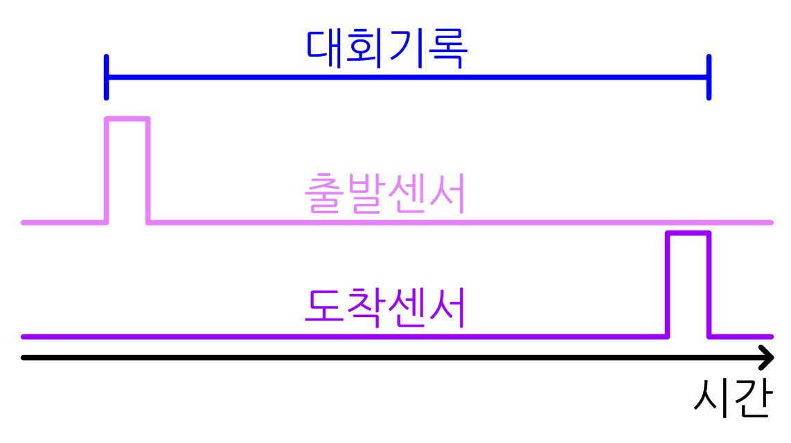

# ZETIN Counter 2023

## 1. 개요

### 1.0. 계수기 정보

- 2023년에 제작한 라인트레이서 기록 측정 장비(계수기)입니다.
- 출발 지점과 종료 지점에 각각 센서를 달아서 이 센서에서의 기록을 바탕으로 기록을 측정합니다.
- 대회 기록은 출발 지점에 센서가 닿인 시점부터 도착 지점에서 센서에서 떨어진 시점까지의 거리를 의미합니다.

  

- 계수기 코드는 Starlit 3.0 기준으로 작성되었고, Starlit 3.2 컴파일러에서 동작하도록 코드를 약간 수정한 것입니다.
  - 이에 따라 Starlit 3.2 코딩 스타일과는 조금 거리가 있을 수도 있습니다.
  - 계수기 코드는 Starlit 3.2 컴파일러에서 작동하지만, 계수기 전용 라이브러리를 사용하셔야 합니다.
  - 따라서 `$import(studio.shc);`의 형태로 임포트하시고 프로그램을 작성해주셔야 합니다.(LED Matrix 작동 규격이 전혀 다름)
 
- 계수기에는 MicroSD카드가 들어있으며, MicroSD 내부에 CSV, TXT, SBC 등의 파일을 추가할 수 있습니다.
  - Starlit 언어로 작성된 코드는 계수기 내부 MicroSD에 저장되며, 계수기로 측정된 기록은 CSV로 저장하여 보관할 수 있습니다.(StarCSV 라이브러리 사용 가능)
 
- 계수기 스펙

  |항목|값|
  |--|--|
  |프로세서(메인보드)|STMicroelectronic, STM32F407VET6|
  |FLASH|512KB|
  |SRAM|192KB|
  |Sensor|Maximum 8 Sensors(6 IR Sensors are connected)|
  |SVM Program Memory|Maximum 64KB(Main SRAM Used)|
  |SVM Stack|Maximum 48KB(CCMRAM Used)|
  |프로세서(LED Matrix)|Microchip, ATmega128|
  |Color|MATR_3, MATR_4 : RGB(8*8 1 Module)|
  |Intensity|64, 픽셀 단위 색상별 개별 밝기제어 가능|
  |Connectivity|SPI Interface(Maximum 4 Matrices can be connected)|
  

  

### 1.1. 2019년도 이후 계수기의 변화

- 2019년도까지는 출발 지점 센서와 도착 지점 센서, 그리고 센서를 구동하는 마이크로컨트롤러만으로 계수기를 제작하였고, 대회 기록은 PC의 화면에 별개로 표시하는 방식을 사용해 왔음.

- 2022년도에는 계수기에 LED Matrix 디스플레이가 추가되고, 센서가 3개로 늘어난다. 따라서 좀 더 정밀하게 기록을 측정할 수 있게 되었다.

- 2023년도, CAD를 활용한 계수기 하드웨어 프레임을 3D프린터 활용해서 제작. 내구성 강화 작업을 거쳐 현재의 계수기 형태를 갖추었다.

- 2024년도 이후에는 2023년도의 계수기 프레임을 기반으로 센서 작동 코드, 새로운 방식의 센서, 추가 기능 등을 수정하는 방식으로 발전해 나가면 될 듯하다.

### 1.2. LED 디스플레이의 이점

- 2022년도에는 빨강+파랑+흰색 LED Display를 달아 주행 방향과 이전 기록 확인, 위치 조정 기능을 추가하였다.
  - 당시는 계수기 원가절감을 위해 LED Matrix 구매비용 절약이 필요하여 RGB Full-Color Display 사용이 어려웠다.
 
- 2023년도에는 RGB Display 2모듈을 계수기에 달아 기록 확인, 주행 시간 표시, 위치 조정, 주행 방향 등을 확인하도록 하였다.
  - 2022년과 다르게 실시간 주행 시간 표시 기능이 추가되었다.
  - 일체형 계수기 특성상 전원을 켜기만 하면 자동 칼리브레이션이 진행되고 바로 계수기를 사용할 수 있다.
    - 만약 자동 칼리브레이션이 실패했다면 메뉴에 들어가서 CA를 눌러 칼리브레이션을 다시 진행하게 설계할 수도 있다.

### 1.3. 계수기 제작자

- 계수기 프레임 : D. H. KIM, K. H. LEE
- 계수기 H/W 회로 : P. J. KIM, C. H. KIM
- 계수기 H/W 코드 : P. J. KIM(Pierre De Starlit)

## 2. 계수기의 주요 기능

### 2.1. 대회 기록 측정

- 평상시에는 대회 기록을 측정하도록 한다. 대기상태(IDLE), 주행상태(Drive)로 작동할 수 있으며, 대기상태에서는 LED Matrix에 화살표(랜덤 색상)를 표시하고, 주행 상태에서는 현재 주행시간을 화면에 보여주었다. 주행이 완료된 상태에 돌입하면 더 이상 시간을 측정하지 않으므로 숫자의 색을 흰색으로 바꿨다.
- 앞에서도 알 수 있듯이 계수기가 출발 센서를 건드리는 순간부터 기록을 측정하게 되며, 도착 센서를 건드리고 센서에서 떨어지는 순간에 기록을 인식하게 된다. 이를 고려하여 State Machine을 구성해야 한다.
- 예외 처리는 매우 중요하다. 주행 중 탈조가 발생할 수 있으며, 센서를 밟고 있는 상태에서 주행을 멈추면 기록을 인정하기 어렵기 때문에 정확한 예외 상황을 판단할 수 있어야 한다.
  - UART로 계수기 통신을 진행하며, 계수기 S/W쪽에서 계수기를 조작한다(H/W 조작자는 특수한 경우가 아닌 이상 계수기의 버튼을 누르지 않는다.).
  - 빨간색 버튼을 누르거나 S/W쪽에서 라인아웃 버튼을 눌러 계수기 기록 측정을 중단할 수 있다.
  - 주행이 완료되어 기록이 인정되는 상황인 경우 S/W쪽으로 기록을 보내준다. 예외 처리 상황인 경우 기록은 갖고 있어도 상관 없으나 S/W쪽으로 전송하지 않게 주의 부탁 드립니다.

### 2.2. 부가 기능

- 계수기가 작동이 불량한 상황에서 조치할 수 있는 기능이 포함되어야 합니다.
- 캘리브레이션 : 라인트레이서 센서 값 조정한 것과 비슷하게 계수기 센서 값을 조정하는 과정. 라인트레이서와 다르게 BlackMin과 WhiteMin을 얻어야 한다.
- 자동 캘리브레이션 : 센서 값을 센서에 손을 대지 않고 자동으로 조정해 주는 과정. 센서가 자동으로 켜질 수 있는 환경에서 동작한다.
- 센서 값 확인하기 : 센서 인식을 감지해서 물체를 감지하는 정도를 정한다. *절대 대회 중 스레시홀드 바꾸지 말것.*
  - RAw : 센서의 ADC값을 바로 확인한다. LED의 밝기가 다소 떨어질 수 있다.
  - NOrmalized : Calibration을 거친 후의 센서 값을 확인해 본다.
  - STate : 물체의 인식 여부를 확인한다. Threshold값을 여기서 설정할 수 있으나, 대회 중 Threshold값을 건드리지는 말자.
  - 화살표 : 주행 방향을 임의로 바꿀 때 사용한다.

## 3. 계수기용 Starlit 익히기

- 아래 내용은 Starlit 3.2 코드로 작성되었습니다.

  |번호|내용|
  |----|----|
  |0|계수기 조작법|
  |1|["Hello, World!" 출력하기](https://github.com/PJungKim/StarCounter2023/blob/main/Docs/001_Hello_World.md)|
  |2|[LED Matrix에 출력하기](https://github.com/PJungKim/StarCounter2023/blob/main/Docs/002_LED_Matrix.md)|
  |3|[버튼 이용하기](https://github.com/PJungKim/StarCounter2023/blob/main/Docs/003_Button.md)|
  |4|[화살표 출력과 스위치 방향](https://github.com/PJungKim/StarCounter2023/blob/main/Docs/004_Arrow.md)|
  |5|[LED Matrix에 원하는 위치에 원하는 점 출력하기](https://github.com/PJungKim/StarCounter2023/blob/main/Docs/005_Matrix.md)|
  |6|[LED Matrix의 추가 기능](https://github.com/PJungKim/StarCounter2023/blob/main/Docs/006_Matrix.md)|
  |7|[센서 값 받아오기](https://github.com/PJungKim/StarCounter2023/blob/main/Docs/007_Sensor.md)|
  |8|[인터럽트](https://zetin.uos.ac.kr)|
  |9|[SPI로 외부 장치 건드리기](https://zetin.uos.ac.kr)|
  |10|[UART로 PC와 통신하기](https://zetin.uos.ac.kr)|

### 3.1. Starlit 구문의 이해

- 아래 내용은 계수기 Starlit 문법과 관련된 리뷰입니다.

  |번호|내용|
  |--|--|
  |1|[변수와 연산자](https://github.com/PJungKim/StarCounter2023/blob/main/Docs/101_Starlit_Variable.md)|
  |2|[조건문과 반복문](https://github.com/PJungKim/StarCounter2023/blob/main/Docs/102_Condition.md)|
  |3|[배열과 반복 연산](https://github.com/PJungKim/StarCounter2023/blob/main/Docs/103_Array.md)|
  |4|[함수](https://github.com/PJungKim/StarCounter2023/blob/main/Docs/104_Function.md)|
  |5|[Call-By-Reference, Return-By-Reference와 Reference 변수](https://github.com/PJungKim/StarCounter2023/blob/main/Docs/105_Reference.md)|
  |6|[객체와 클래스](https://github.com/PJungKim/StarCounter2023/blob/main/Docs/106_Class.md)|

## 4. 계수기 코딩하기

- 아래 내용은 Starlit 3.2 코드로 작성되었습니다.

  |번호|내용|
  |----|----|
  |1|[Calibration, Normalization](https://zetin.uos.ac.kr)|
  |2|[State, Threshold](https://zetin.uos.ac.kr)|
  |3|[통신 규격 정하기](https://github.com/PJungKim/StarCounter2023/blob/main/Docs/703_Communication.md)|
  |4|[계수기 State Machine](https://zetin.uos.ac.kr)|
  

